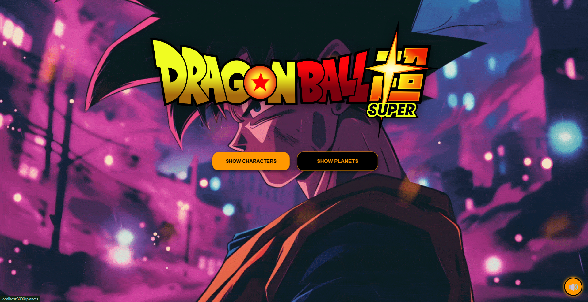

# 🐉 Dragon Ball Z Explorer

A full-stack, **“Super Saiyan” level** web application built with **Node.js**, **Express**, and **EJS**.

This project allows users to explore the vast universe of **Dragon Ball Z** — from iconic characters to distant planets — by pulling real-time data from the [Dragon Ball API](https://web.dragonball-api.com/documentation).



---

## 🌟 Features

### 🔎 Character Database
Browse a complete list of fighters with detailed stats, descriptions, and background information.

### 🌍 Planet Explorer
Discover legendary worlds from the DBZ universe — from Namek to Planet Vegeta.

### 📖 Deep-Dive Details
View:
- Transformations  
- Ki levels  
- Origin stories  
- Character stats  

### ⚡ Dynamic Search
Instantly find your favorite warriors using the live search feature.

### 🎵 Immersive Experience
- Background music integration  
- Smooth scroll-triggered animations using the Intersection Observer API

---

## 🛡️ Security & Performance

This project goes beyond visuals and implements production-level security practices:

### 🧠 Ultra Instinct Headers (Helmet.js)
- Secures HTTP headers  
- Prevents clickjacking  
- Protects against MIME sniffing  
- Mitigates XSS attacks  

### 🛡️ “Ki Shield” Rate Limiting
- Protects against spam and bot attacks  
- Displays a custom **“Limit Break”** error page when limits are exceeded  

### 🔒 Data Sanitization
- Uses `encodeURIComponent()` for safe URL handling  
- Leverages EJS’s built-in escaping to prevent XSS  

### 🧩 Defensive Coding
- Validates API responses  
- Prevents server crashes from malformed or unexpected data  

---

## 🛠️ Tech Stack


* **Backend**: Node.js, Express.js
* **Frontend**: EJS (Embedded JavaScript), CSS3, Vanilla JavaScript
* **API Interactions**: Axios
* **Security**: Helmet, Express-Rate-Limit

---

## 🚀 Installation & Setup

### 1️⃣ Clone the Repository

```bash
git clone https://github.com/RSP-007/DBZ-Web.git

cd DBZ-Web
```

### 2️⃣ Install Dependencies

```bash
npm install
```

### 3️⃣ Run the Server

```bash
node app.js
```

Or, if you use Nodemon:

```bash
npm run dev
```

### 4️⃣ Open in Browser

Visit:

```
http://localhost:3000
```

---

## 📁 Project Structure

```
DBZ-MAIN
│
├── node_modules/
│
├── public/
│   ├── styles/
│   │   ├── 404.css
│   │   ├── characters.css
│   │   ├── error.css
│   │   ├── main.css
│   │   ├── planets.css
│   │   └── transformation.css
│   │
│   ├── audio-handler.js
│   ├── card-observer.js
│   ├── dbz-dragon-ball-z-goku-dragon-ball-super.jpg
│   ├── dragon-ball-goku-sparks-gif-preview.gif
│   ├── Dragon-Ball-Z-Logo-PNG-File.png
│   └── thisisbeatkitchen-beatkitchen-i-will-fight.mp3
│
├── views/
│   ├── 404.ejs
│   ├── character-details.ejs
│   ├── characters.ejs
│   ├── error-limiter.ejs
│   ├── index.ejs
│   └── planets.ejs
│
├── .gitignore
├── app.js
├── LICENSE
├── package-lock.json
├── package.json
└── README.md
```


## 📜 License

This project is licensed under the **MIT License**.  
See the `LICENSE` file for more details.

---

## 🤝 Credits

- Data provided by the **Dragon Ball API**
- Created by **RSP-007** as part of a Web Development Portfolio project